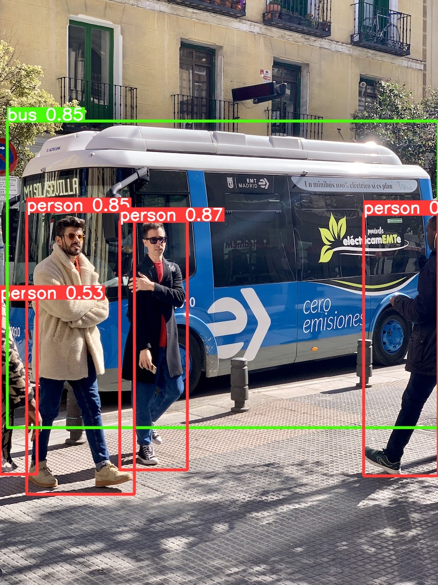
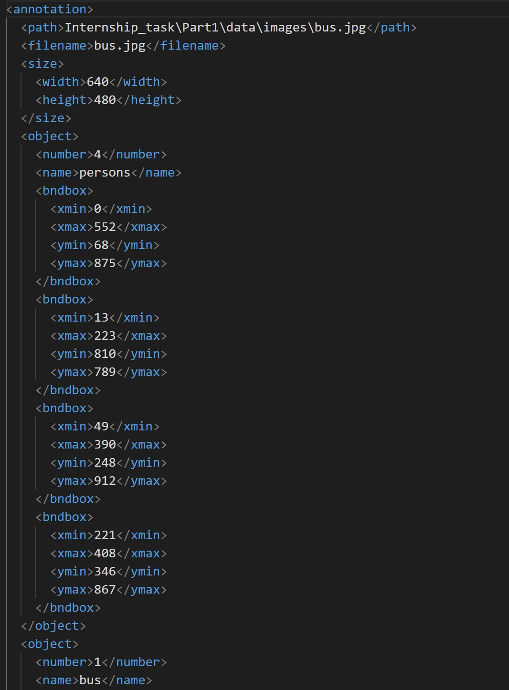
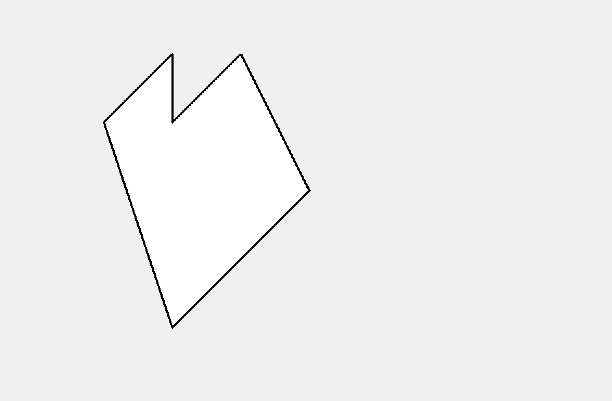

# Internship_task
## Part1
### Objective
Input a jpg image,run through the YOLOv5 model and get annotations in a XML format.
 <details open>
<summary>Install</summary>
 
Clone repo and install [requirements.txt](https://github.com/aku134/Internship_task/blob/master/Part1/requirements.txt)
  
```bash
git clone https://github.com/aku134/Internship_task.git  # clone
cd Part1
pip install -r requirements.txt  # install
```
</details>
<details open>
<summary>Run</summary>
Run the following command to get annotations of the image in a XML file.
  
```bash
python detect.py --source data/images/bus.jpg
```
 </details>
 <details open>
<summary>Output</summary>




</details>
The XML file is saved as result_to_xml.xml in the same directory.The image result is saved under runs/detect.

## Part2
### Objective
Given n number of unordered points,create a function that returns a polgon passing through all the points.
<details open>
<summary>Install</summary>
Install tkinter which is an open source python package that helps create GUIs.

```bash
pip install tk
```
</details>
<details open>
<summary>Run</summary>

```bash
python app.py
```
</details>
<details open>
<summary>Output</summary>


</details>
The polygon shape is drawn on tkinter canvas window.


